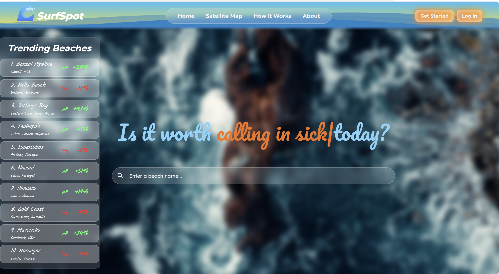
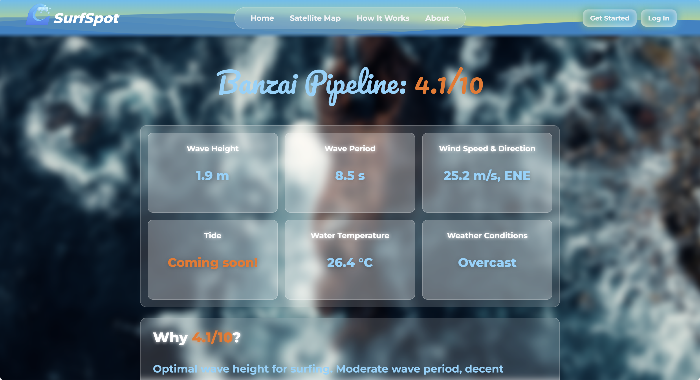
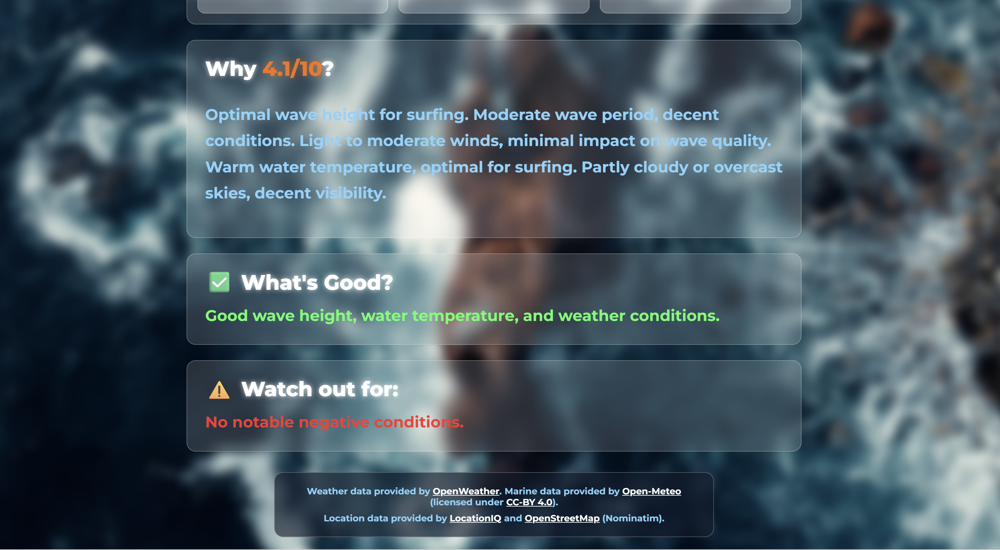

# SurfSpot: Real Time Surfing Forecasts for any Spot in the World

## Try the Live Demo
https://surf-spot-ruddy.vercel.app/

> Note: The backend is hosted on a free tier and may take 20–50 seconds to wake up on the first request after not being used. Afterwards, searches will be fast.

## What is SurfSpot
SurfSpot is a surf forecasting web app that provides real-time data, simplifying multiple stats into a single rating and simple insights so surfers know if it's worth calling in sick.

## Why I Built SurfSpot
I built SurfSpot as I was getting into surfing and needed a tool that could give me instant forecasts, in a format I actually wanted, no matter where in the world I am. I wanted to learn full-stack development by building something real from scratch rather than just copying tutorials, so I decided to build SurfSpot end-to-end as a 19-day sprint.

## Stack I Used
Frontend: I built the frontend with React, TypeScript, and I went for a glassmorphism style via App.css. I used React Router for persistent layouts and routing, and I built a custom animation for the center header of the homepage.

Backend: I built the backend with Java Spring Boot REST endpoints, using Java Records (DTOs) and custom string normalisation to handle user inputs. I used a multi-fallback strategy: LocationIQ coastal search first (sorted by importance), falling back to Nominatim coastal search (sorted by importance), and recursively stripping suffixes like "beach" or "spot" if the initial searches fail.

Scoring Algorithm & Insights: I built a custom algorithm that converts the raw marine data from open-meteo and weather data from OpenWeatherMap into a single rating out of 10. Then I take that rating, and using a formula I created, I weight the ratings, and connect them (some are dependent on others) to create the final spot rating. I also wrote custom logic that creates reasoning, and  understandable insights based off the raw data.

## How It Works
1. Search: Use the search bar to find any surfing spot in the world.

2. Locate & Fetch Conditions: SurfSpot finds the spot's exact coordinates, then gathers the current conditions of that spot using external APIs.

3. Analyse: SurfSpot calculates a 1-10 rating for the spot via our algorithm that evaluates wave height, period, water temperature, wind speed, and weather conditions. Then SurfSpot provides reasoning for that score, including a breakdown of what is good and what to watch out for.

User inputted beach name -> Geocoding -> Coordinates -> Marine data from open-meteo, weather data from OpenWeatherMap -> Rating algorithm -> React UI

## Running SurfSpot Locally
1. git clone https://github.com/marcus-j-c/SurfSpot.git

2. cd backend -> $env:LOCATIONIQ_KEY = 'yourkey' -> $env:OWM_API_KEY = 'yourkey' -> .\mvnw.cmd spring-boot:run

3. cd frontend -> npm install -> npm run dev

4. API keys are required for LocationIQ and OpenWeatherMap, but these are available for free, no API keys are needed for open-meteo or Nominatim. 

## Known Limitations (Future Additions In V2)
- Currently the trending beaches sidebar is not dynamic, because SurfSpot is not connected to a database, and so it carries out real searches (clicking Bells Beach is the same as searching it in the search bar), but the list doesn't change and popularity data is hardcoded.

- Currently, the satellite map is not added as this would require entirely separate APIs and hence was out of the scope of V1's timeline, this is the same reason tide data has not been included in the beach stats, nor the rating algorithm.

- Due to SurfSpot not having a database, the account buttons are currently also non functional, in future these will be used, and account info will affect the rating algorithm.

- Due to SurfSpot not having a database, API results cannot be cached, in future versions, I hope to only update data every hour, or whenever the spot is searched, whatever is less frequent, in order to save API tokens.

- All other information on SurfSpot, such as conditions, and ratings are real and dynamic, only items explicitly mentioned above as not, are not.
